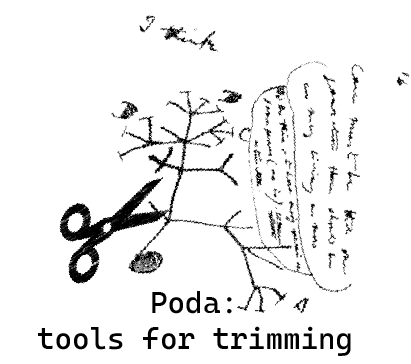

# Poda
 Tools to trim alignments and prune trees.  
 
 
> *Poda* is the portuguese word for pruning

This repository contains scripts and custom programs to search and remove sequences that result in long branches on trees due to bad quality, missing data and/or paralogy. They were used in the following published papers:  
[Azevedo et al. 2024. Molecular Phylogenetics and Evolution, 197.](https://doi.org/10.1016/j.ympev.2024.108109)  
[Azevedo et al. 2024. Conservation Genetics 25, 149–164.](https://doi.org/10.1016/j.ympev.2024.108109)  


## Installation
Most of the programs call other programs and libraries commonly used in phylogenetics that need to be installed. If you use the tools available here, please cite those programs.

- [IQTREE](http://www.iqtree.org/) v2.1.2
- [TreeShrink](https://uym2.github.io/TreeShrink/) v1.3.7
- [GNU parallel](https://www.gnu.org/software/parallel/sem.html) v20220722
- [DendroPy](https://dendropy.org/) v4.5.2


To install those dependencies, I suggest using a conda environment since I don't know if they will work with other versions of the programs. Follow the instructions for your platform that are available on the [miniconda website](https://docs.conda.io/en/latest/miniconda.html) to install conda.

```bash
conda create --name poda
conda activate poda
conda install -c bioconda iqtree=2.1.2
conda install -c smirarab treeshrink=1.3.7
conda install -c bioconda dendropy=4.5.2
conda install -c conda-forge parallel=v20220722
```
Clone this repository and change permissions for the files in the source folder.

```
git clone https://github.com/GHFAzevedo/Poda

cd Poda

#create a variable for the path to poda folder
path_to_poda=$(pwd)

# Add permission to execute the files
chmod +x $path_to_poda/source/*.* 

## OPTIONAL: Add folder with the scripts and programs to $PATH, but make a backup of the bashrc file before modifying it. 

cp ~/.bashrc mybash_backup
echo '
# >>> Path to custom_programs_and_scripts >>>
export PATH="'$path_to_poda'/source:$PATH"
# <<< Path to custom_programs_and_scripts <<<' >> ~/.bashrc

source ~/.bashrc
```

## Programs and Scripts

### [clean_alignments_cialign.sh](source/clean_alignments_cialign.sh)

This program runs CIAlign over all aligned fasta files in a folder.
It requires CIAlign to be installed in your system. Please see https://github.com/KatyBrown/CIAlign and cite CIAlign:

Tumescheit C, Firth AE, Brown K. 2022. CIAlign: A highly customisable command line tool to clean, interpret and visualise multiple sequence alignments. PeerJ 10:e12983 https://doi.org/10.7717/peerj.12983

Usage:
```
clean_alignments_cialign.sh -I input_folder [-d min_diver -o output_folder -i min_insertion] 

      -A input_folder               The folder containing the fasta files 
                                       with aligned sequences.
      -d min_diver                  The threshold for the
                                       divergence below which the sequence
                                       is removed from alignment.
                                       (Default: 0.65)
      -o output_folder              The name of the output folder. 
                                      (Default: input_folder_CIAlign)
      -i min_insertion              Remove insertions which are present in
                                      less than this proportion of
                                      sequences.(Default:0.25)
      -l min_perc_length            Remove sequences which length is
                                      smaller than this percentage of
                                      total alignment length. It is a 
                                      modification of the CIAlign
                                      --remove_min_length to account for
                                      each alignment length. It should be
                                      an integer between 0 and 100. 
                                      A value of 10 will remove sequences
                                      that are 20 bases long (excluding 
                                      gaps) in an alignment of length 
                                      200b, and 100b in a alignment of 
                                      1000b. (Default:10)
      -j n_jobs                  Number of jobs to be parallelized.(Default:1)
                                       Note that j*n should not exceed total cores.	
      -h                            Print this message and exit.
```

### [remove_paralogs_treeshrink.sh](source/remove_paralogs_treeshrink.sh)

This program prepares the input files to run TreeShrink and remove possible paralogs from alignments and outputs a folder with alignments with paralog sequences removed.
It requires IQTREE and TreeShrink to be installed in your system. Please see http://www.iqtree.org/ and https://uym2.github.io/TreeShrink/ and cite both programs.

It takes as input a folder with alinments. Gene trees will be estimated for each alignment using a GTR+F+G model. 

>Note: this can take a long time since it will run a gene tree for each alignment and then run TreeShrink.  
  

Usage:
```
remove_paralogs_treeshrink.sh -I folder_with_alignments [-q TreeShrink_q -k TreeShrink_k -s TreeShrink_s  -t n_threads] 

      -I folder_with_alignments     The folder containing the aligned 
                                       fasta files.
      -q TreeShrink_q               The -q argument for TreeShrink.
                                        Default: 0.05
      -k TreeShrink_k               The -k argument for TreeShrink.
	                                    Default: none (auto-select).
	  -s TreeShrink_s       	    The -s argument for TreeShrink.
	                                    Default: '5,2' 
      -t n_threads                  Number of threads to be 
                                       used (Default:12).
      -j n_jobs               Number of jobs to be parallelized.(Default:1)
                                 Note that j*n should not exceed total number of cores.
      -h                            Print this message and exit.
```

### [find_long_branches.py](source/find_long_branches.py)
Find branches which lenght is bigger than *p* percent of total three length.   
  
It takes as input a tree in newick format and returns a "check" warnning with the length of the branch if the tree has a branch that is equal or bigger than *p* percent

> This script is used in the bash program [screen_for_long_branches.sh](source/screen_for_long_branches.sh) detailed below.

It uses [DendroPy](https://dendropy.org/) library. Please Se the [website](https://dendropy.org/) and cite it.  

Usage:

```
 find_long_branches.py [-h] -t TREE [-p PERCENT]

Find branches which lenght is bigger than p percentage of total three length.

required arguments:
  -t TREE, --tree TREE  File with trees

optional arguments:
  -p PERCENT, --brlen_max_proportion PERCENT
                        The maximum percentage of total tree length for a branch to be acceptable. Default = 0.5
```


### [screen_for_long_branches.sh](source/screen_for_long_branches.sh)  
Iterates over the results of the [remove_paralogs_treeshrink.sh](source/remove_paralogs_treeshrink.sh) using [find_long_branches.py](source/find_long_branches.py) to search for long branches that passed through treeshrink run. Sometimes, when there is an long internal branch, that could indicate a gene duplication, TreeShrink does not remove the taxa. The output list the alignments that need to be checked, so you can decide to remove it or not.

Usage:
```
screen_for_long_branches.sh folder_with_the_tree_shrink_outputs \
                            folder_with_the_shrunk_alignments

```
